# Introdução a desenhos vetoriais no Inkscape

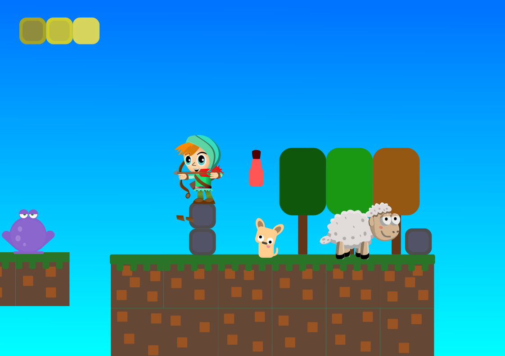

[TOC]

## **Minicurso FoG - Desenhos vetoriais no Inkscape**

Artes vetoriais são utilizadas na web, nas gráficas e nos jogos, permitindo visuais com qualidade superior e utilizando arquivos extremamente compactos. Neste minicurso, busca-se introduzir o aluno a conceitos sobre desenhos vetoriais, com exemplos teóricos e práticos, e à utilização das principais funções do software gratuito, Inkscape.

### **Minicurso 2021**

[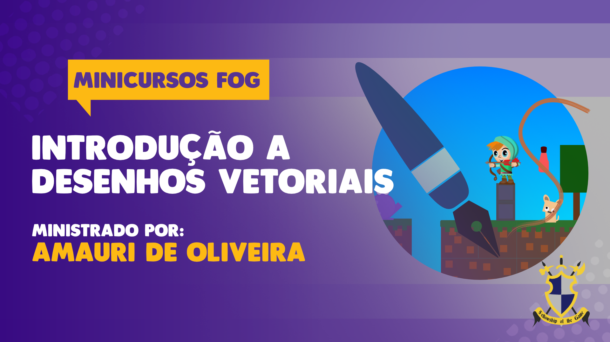](https://www.youtube.com/watch?v=xBnYS0HYqyI)

> Download do PDF

[DOWNLOAD](Desenhos%20vetoriais%20no%20Inkscape.pdf)

## Sobre SVG

### História do SVG

- Criado em 1998 pela W3C.
- Começou a ser usado até 2005 quando adobe começou usar o Flash e SVG caiu em parou de ser usado nos navegadores.
- 2008 Apple bloqueia o flash.
- 2010 IE9 começa a dar suporte a SVG.
- 2012 Android suporta SVG.
- Empresa grandes estão usando SVG na web devido a qualidade.

### O que é SVG?

- SVG significa Scalable Vector Graphics.
- SVG é usado para definir gráficos baseados em vetores para a Web.
- SVG define os gráficos em formato XML é bem similar ao HTML.
- SVG suporta interatividade, cada elemento e cada atributo em arquivos SVG podem ser animados.
- SVG é uma recomendação W3C.
- SVG se integra a outros padrões W3C, como DOM e XSL.
- Ele NÃO permite tantos detalhes como uma imagem com pixel

### Vantagens do SVG

- As vantagens de usar SVG em relação a outros formatos de imagem (como JPEG e GIF) são:
- As imagens SVG podem ser criadas e editadas com qualquer editor de texto.
- As imagens SVG podem ser pesquisadas, indexadas, com script e compactadas.
- Imagens SVG são escalonáveis.
- As imagens SVG podem ser impressas com alta qualidade em qualquer resolução.
- Os gráficos SVG NÃO perdem qualidade se forem ampliados ou redimensionados.
- SVG é um padrão aberto.
- Arquivos SVG são XML puro.

```xml
<svg xmlns="http://www.w3.org/2000/svg" width="34" height="34" viewBox="0 0 8.996 8.996">
  <path
    d="M8.996 4.525A4.52 4.52 0 015.2 8.995v-3.16h1.047l.201-1.31H5.2v-.847c0-.358.175-.708.732-.708h.57V1.857s-.517-.09-1.007-.09c-1.03 0-1.701.627-1.701 1.763v.995H2.652v1.31h1.142v3.16A4.52 4.52 0 010 4.526C0 2.025 2.014 0 4.498 0c2.484 0 4.498 2.026 4.498 4.525"
    fill="#fff" />
</svg>
```

### Exemplos de Animações

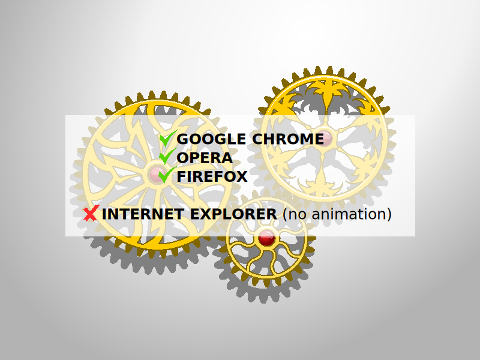

[Animation Inkscape Carp](https://inkscape.org/~IK/%E2%98%85animation-inkscape-koi-carp)

Criação de imagens SVG As imagens SVG podem ser criadas com qualquer editor de texto, mas geralmente é mais conveniente criar imagens SVG com um programa de desenho, como o Inkscape.

## **Links para os softwares utilizados no minicurso:**

### **Inkscape:**

[Download](https://inkscape.org/release/inkscape-master/?latest=1)

[Plugin](https://inkscape.org/~olibia/%E2%98%85generate-palette-extension)

## Configuração

- Como configurar

  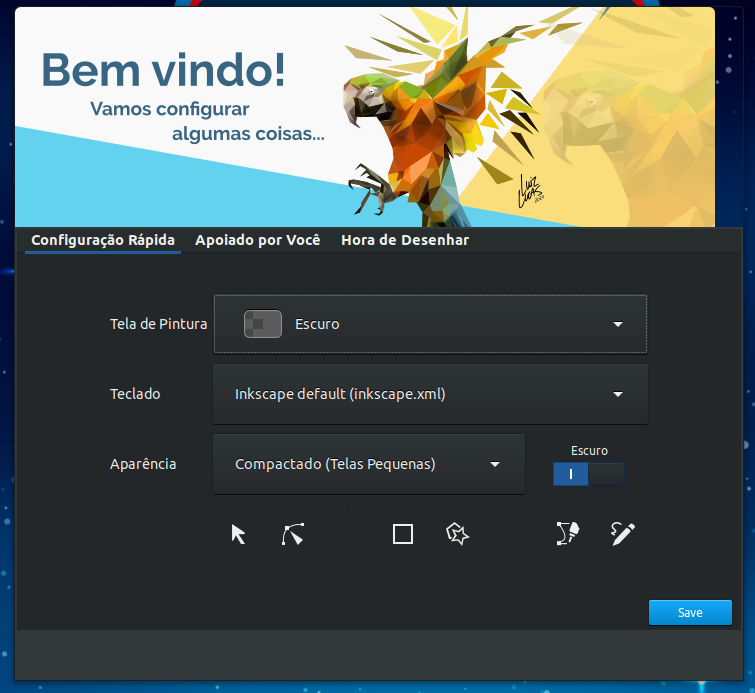

  

## Interface

- Partes

  

  1. Ferramentas de desenhos.
  2. Outras ferramentas de desenhos.
  3. Paleta de cores.
  4. Escolher paletas de cores.
  5. Opções do item selecionado e outras informações.
  6. Opções frequentes.
  7. Painel de magnetismo.
  8. Opções das ferramentas.
  9. Tela de desenho.
  10. Opções da ferramenta de desenho selecionada.
  11. Menu.

- Ferramentas

### Exportar Image Bitmap

Pode ser acessado pelo menu: Arquivos/Exportar Image Bitmap.


### Propriedades do Desenho

Pode ser acessado pelo menu: Arquivo/Propriedades do Desenho.


### Preenchimento e Contorno

Pode ser acessado pelo menu: Objeto/Preenchimento e Contorno.


### Alinhar e Distribuir

Pode ser acessado pelo menu: Objeto/Alinhar e Distribuir.


### Efeitos de Caminhos

Pode ser acessado pelo menu: Caminho/Efeitos de Caminhos.


## Botões

- Lista

  

## Exemplos de minhas artes

- Boneco

  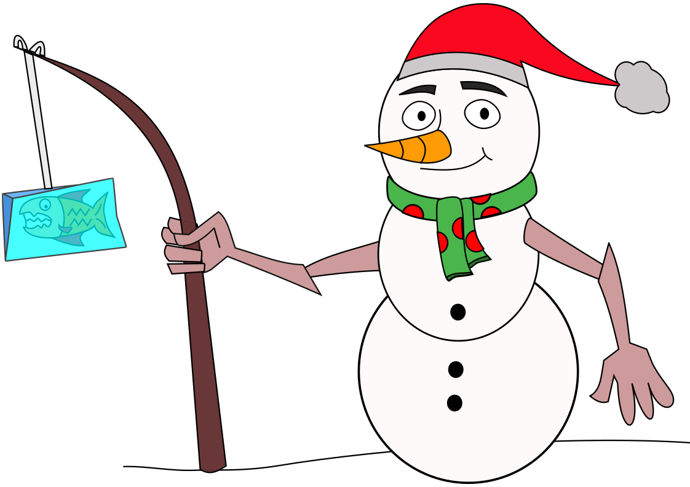

- Espantalho

  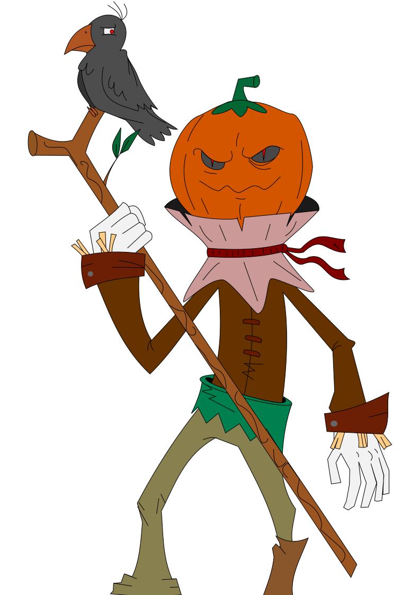

- Ovelha

  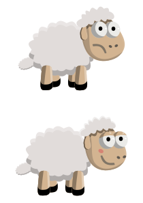

- Arqueiro

  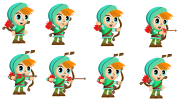

## Dicas e truques

- Clip

  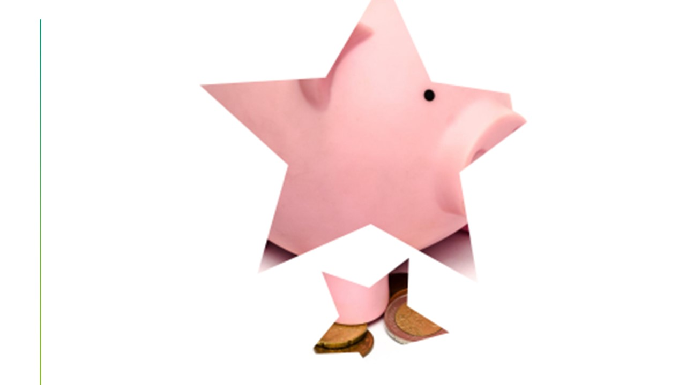

  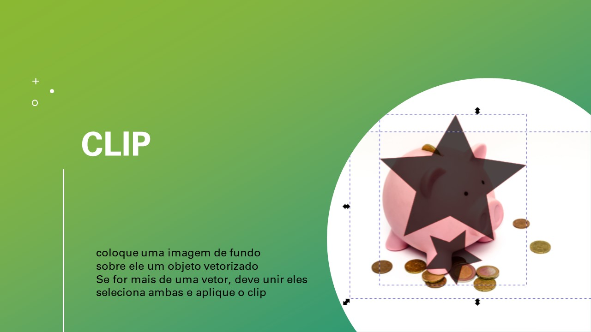

- Máscara

  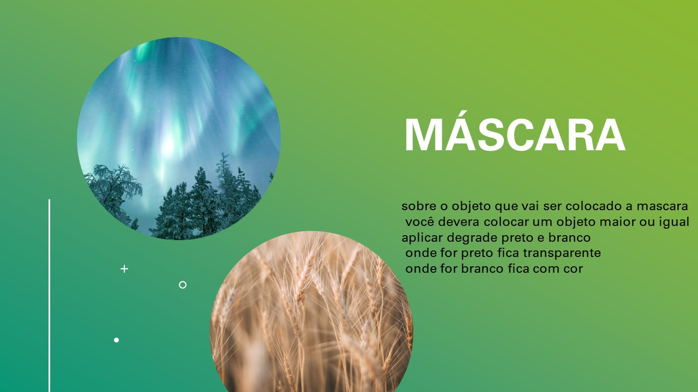

  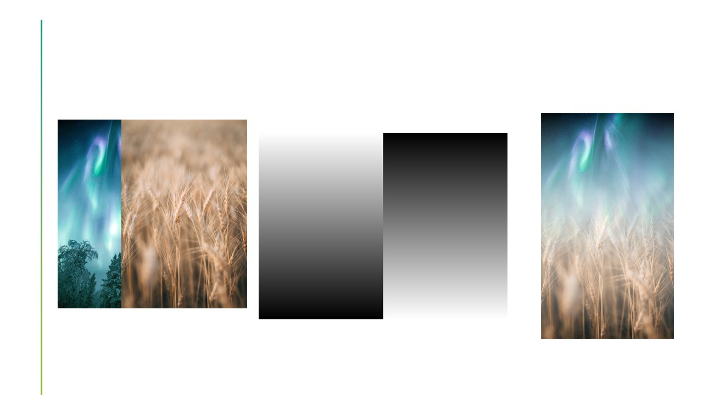

- Remover fundo

  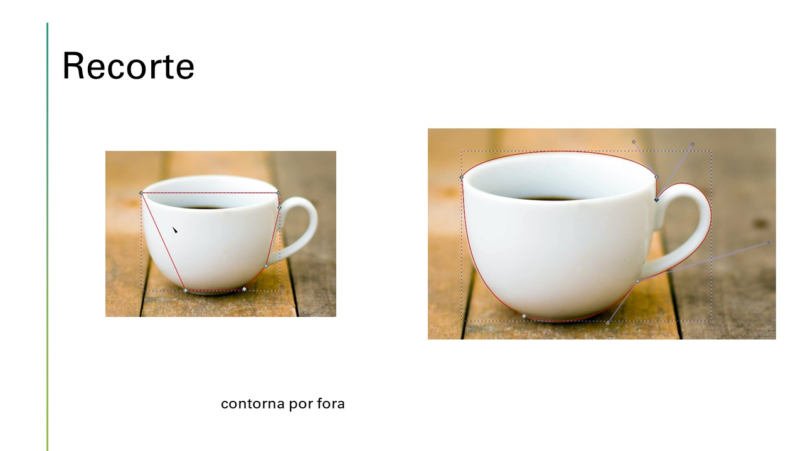

  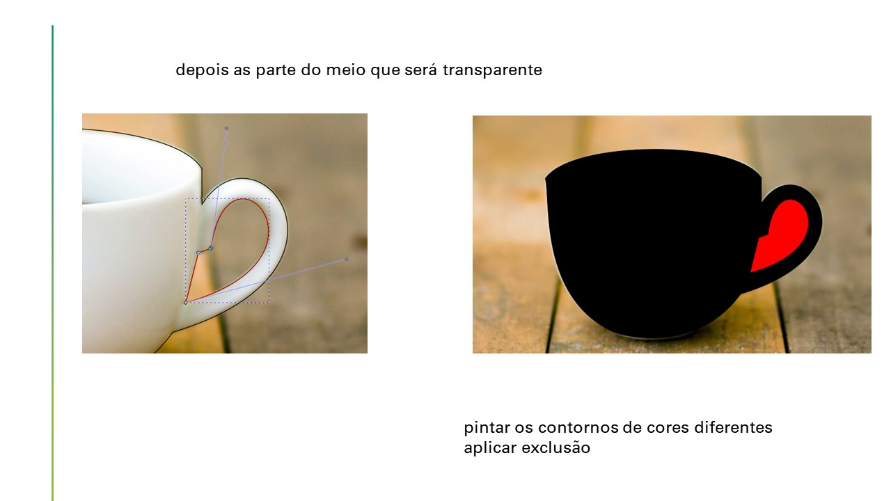

  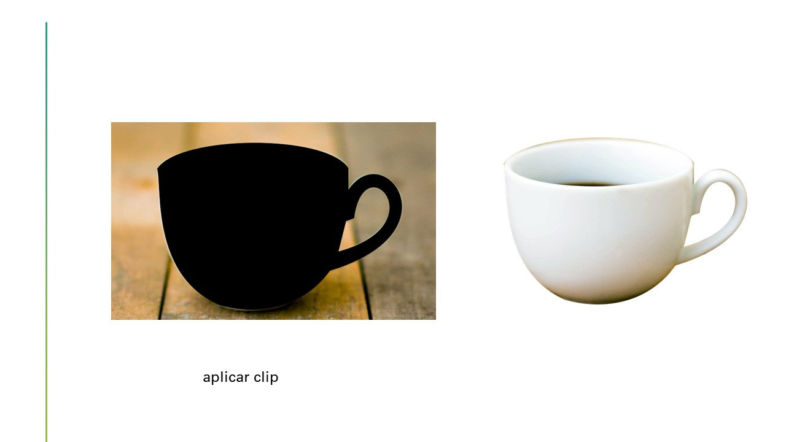

- Caminhos

  

  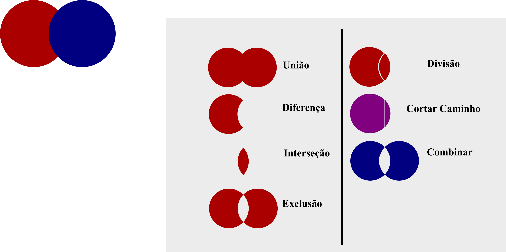

- Beziér

  Recomendo marcar.

  

- Guias

  Pode adicionar guia no desenho, ela não é fica nas exportações. Ao clicar com botão esquerdo do Mouse sobre a régua e segurar e arrastar pode trazer

  

  **Sobre a live**

## Sobre

Minicurso ministrado pelo membro do FoG, Amauri Antonio de Oliveira

- Contato

  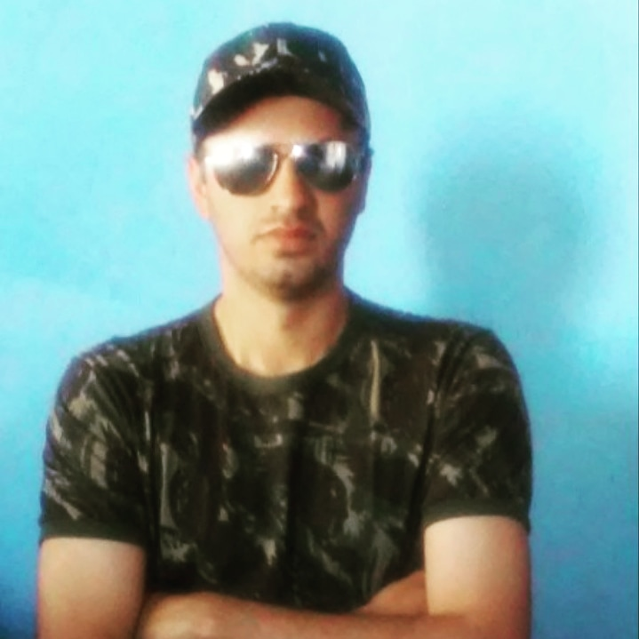

  [@amauri_oliveira](https://linktr.ee/amauri_oliveira)

### **Conheça o Fellowship of the Game na internet!**

[YouTube](https://www.youtube.com/c/FellowshipoftheGame)

[itch](https://fog-icmc.itch.io/)

[Facebook](https://www.facebook.com/fogicmc)

[Instagram](https://www.instagram.com/fog_icmc/)

[Twitter](https://twitter.com/fogicmcusp)

[LinkedIn](https://www.linkedin.com/company/fellowship-of-the-game)

## **Conteúdo complementar opcional recomendado:**

### **Minicurso 2020**

[](https://youtu.be/4BdVKQ4TDA0)

- Partes

  Vetorizando espantalho

  [Desenhos vetoriais no Inkscape](https://youtu.be/4BdVKQ4TDA0?t=2385)

  Exportando do Inkscape e animando com DragonBones

  [Desenhos vetoriais no Inkscape](https://youtu.be/4BdVKQ4TDA0?t=9362)

  Exportando do DragonBones pra Unity

  [Desenhos vetoriais no Inkscape](https://youtu.be/4BdVKQ4TDA0?t=12016)

  VS Code e o script para controlar a animação

  [Desenhos vetoriais no Inkscape](https://youtu.be/4BdVKQ4TDA0?t=12213)

### **Bancos de vetores:**

[vecteezy](https://www.vecteezy.com/)

[shutterstock](https://www.shutterstock.com/pt/vectors)

### **Patterns:**

[kennethcachia](http://www.kennethcachia.com/plain-pattern/app)

[trianglifly](https://trianglify.io/)

### **Sobre vetores:**

[MiniCurso2020](https://github.com/AmauriOliveira/MiniCurso2020)

[Shape Language](https://blog.duolingo.com/shape-language-duolingos-art-style/)

[Como desenhar um personagem](https://www.youtube.com/watch?v=eNpK0UExm7A)

[Como desenhar um cenário de plataforma](https://www.youtube.com/watch?v=yan-mTXvapQ)

[Awesome-svg](https://github.com/willianjusten/awesome-svg)

[W3schools](https://www.w3schools.com/graphics/svg_intro.asp)

[svg Cuts](https://svgcuts.com/)

[curso Udemy](https://www.udemy.com/course/aprendendo-svg-do-inicio-ao-avancado)

[curso Udemy](https://www.udemy.com/course/desenvolvimento-de-artes-para-jogos)

